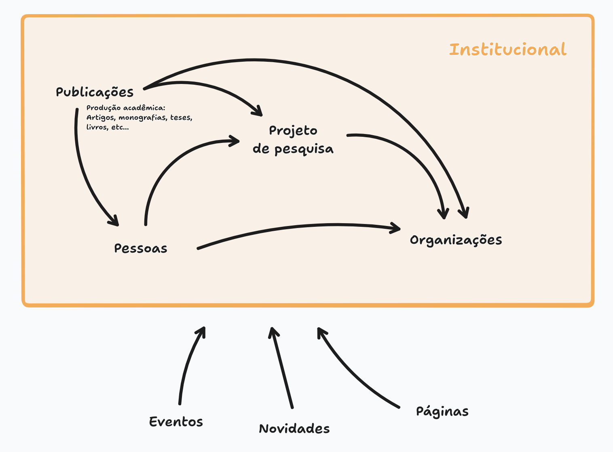

O site é composto por diferentes Tipos de Conteúdo, ou [Coleções](https://payloadcms.com/docs/configuration/collections). As coleções são divididas em
três categorias: [**Institucional**](#institucional), [**Website**](#website) e [**Arquivos e configurações**](#arquivos-e-configurações).

**Institucional:** se refere a informações sobre os elementos que estruturam o Instituto e as relações entre eles.

**Website**: se refere a ações e comunicações do Instituto com o público geral.

## Coleções

### Institucional

- [Organizações](/collections/organizations)
- [Pessoas](/collections/persons)
- [Projetos de Pesquisa](/collections/researchprojects)
- [Publicações](/collections/publications)

### Website

- [Páginas](/collections/pages)
- [Novidades (Posts)](/collections/posts)
- [Eventos](/collections/eventos)

### Arquivos e configurações

- [Mídia](/collections/media)
- [Arquivos](/collections/files)
- [Dicionário de Termos](/collections/definedterms)
